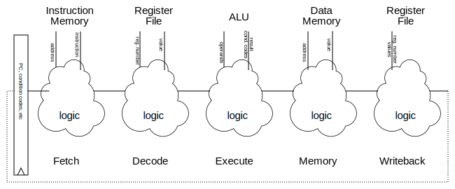

---
title: Processors
...

> This writeup is incomplete and unlikely to make much sense out of context of the associated lectures.

# Organizing a processor

A processor has a lot of parts and pieces.
It can help keep them orderly if we break them into named components,
similar to naming functions in C.
There are various names used, but one common model is to consider five steps:

1. Fetch, reads an instruction from memory
2. Decode, retrieves values from registers
3. Execute, uses the ALU
4. Memory, reads or writes to one address of memory
5. Writeback, puts results into register

For example, the instruction `pushq %r8`, would

1. Fetch that instruction from memory
2. Detect it is a `push` and read the values of `%r8` and `%rsp` from the register file
3. Compute the new value for `%rsp` by sending `%rsp`'s value and `$-8` into the ALU
4. Send the value of `%r8` to memory to be written at the address `%rsp - $8`
5. Send the new `%rsp` back to the register file

This organization does not change what transistors and wires we actually put on the chip, but it does help us think about what purpose they each serve.

# Pipelining

Real processors *pipeline* instructions:
that is, they split up the work of a single instruction
into several components and divide them up into multiple steps.
And not just as an organizational aid; they add register banks between the steps.

These between-stages registers are called "pipeline registers";
they handle moving instructions one stage at a time.
Because registers require a clock signal to change values,
this means that a single instruction moves from stage to stage across several clock cycles.

{.example ...} Consider the following code

    evaluate:
        xorl    %eax, %eax
        cmpq    $1, %rdi
        je      evaluate_end
        movl    $1, %ecx
    evaluate_loop:
        incq    %rax
        movq    %rdi, %rdx
        sarq    %rdx
        testb   $1, %dil
        leaq    1(%rdi,%rdi,2), %rdi
        cmovneq %rdx, %rdi
        cmpq    %rcx, %rdi
        jne     evaluate_loop
    evaluate_end:
        retq

Three cycles after calling this function,
the state of the processor would look like

<table border="0" width="100%"><tbody>
<tr><td colspan="5">

</td></tr>
<tr><td width="20%" style="text-align:center">je</td>
<td width="20%" style="text-align:center">cmpq</td>
<td width="20%" style="text-align:center">xorl</td>
<td width="20%" style="text-align:center">callq</td>
<td width="20%" style="text-align:center"></td>
</tr></tbody></table>

The last stage would presumably still be working on the code that called this function.
{/}

## Dependencies

A later instruction can depend on an earlier instruction in two ways

1. A *data dependency* occurs when information needed to correctly execute the later instruction is computed by the earlier instruction.

    - The instruction pair `addq %rax, %rcx; addq %rcx, %rdx` has a data dependency: the first computes the `%rcx` value needed by the second.
    - The instruction pair `addq %rax, %rcx; cmovle %r8, %r9` has a data dependency: whether `cmovle` changes `%r9` or not depends on the condition codes set by `addq`.

1. A *control dependency* occurs when the earlier instruction determined whether a later instruction should even be executed.

    - The instruction pair `jle foo; addq %rcx, %rdx` has a control dependency: the second might not be run depending on the result of the first.
    - The instruction `retq` has a control dependency with whatever instruction runs next: which one it is depends on what value `retq` pops off the stack.

The existence of both kinds of dependencies can be determined by inspecting the assembly in a algorithmically-trivial way simply by comparing arguments and icodes.

Dependencies can cause problems in a pipeline, causing naïve implementations to compute the wrong result because the earlier instruction will not have completed when the later instruction begins to execute.
Three basic tactics can be used to resolve these issues.

### Stalling

The simplest solution to a dependency is to simply wait for the results to appear.

{.example ...} Let's look at the last example again.

    evaluate:
        xorl    %eax, %eax
        cmpq    $1, %rdi
        je      evaluate_end
        movl    $1, %ecx
        /*...*/
    evaluate_end:
        retq

Let's trace it through, starting with the `callq evaluate`, stalling anytime we need to. Note that in practice we'd not stall this much, using [forwarding](#forwarding) to avoid most of these stalls.

1.  First we callq.

    <table border="0" width="100%"><tbody><tr>
<td width="20%" style="text-align:center">callq</td>
<td width="20%" style="text-align:center"></td>
<td width="20%" style="text-align:center"></td>
<td width="20%" style="text-align:center"></td>
<td width="20%" style="text-align:center"></td>
</tr></tbody></table>
    
1.  Since `callq` has its destination right in its instruction as an immediate, Fetch was able to pick the next instruction: `xorl`, the first instruction of the new function.
    `callq` still has work to do, though, pushing a return address, so it's still in the pipeline.

    <table border="0" width="100%"><tbody><tr>
<td width="20%" style="text-align:center">xorl</td>
<td width="20%" style="text-align:center">callq</td>
<td width="20%" style="text-align:center"></td>
<td width="20%" style="text-align:center"></td>
<td width="20%" style="text-align:center"></td>
</tr></tbody></table>

    
1.  No dependency between `xorl` and `callq`, so we let them move on and lad the next instruction:

    <table border="0" width="100%"><tbody><tr>
<td width="20%" style="text-align:center">cmpq</td>
<td width="20%" style="text-align:center">xorl</td>
<td width="20%" style="text-align:center">callq</td>
<td width="20%" style="text-align:center"></td>
<td width="20%" style="text-align:center"></td>
</tr></tbody></table>

1.  No dependency between `cmpq`, `xorl`, `callq`, so we let them move on and lad the next instruction:

    <table border="0" width="100%"><tbody><tr>
<td width="20%" style="text-align:center">je</td>
<td width="20%" style="text-align:center">cmpq</td>
<td width="20%" style="text-align:center">xorl</td>
<td width="20%" style="text-align:center">callq</td>
<td width="20%" style="text-align:center"></td>
</tr></tbody></table>

1.  `je` has a data dependency on `cmpq`: it needs the condition codes. So we stall `je`, leaving it where it is. We do let the others move on. To handle the gap, the stalled `je` inserts a `nop` instruction after itself.

    <table border="0" width="100%"><tbody><tr>
<td width="20%" style="text-align:center">je</td>
<td width="20%" style="text-align:center">*nop*</td>
<td width="20%" style="text-align:center">cmpq</td>
<td width="20%" style="text-align:center">xorl</td>
<td width="20%" style="text-align:center">callq</td>
</tr></tbody></table>

1.  `je` is still waiting on `cmpq`; `cmpq` did compute the flags already, but they are not in the flags register yet, nor will be until `cmpq`'s writeback finishes.

    <table border="0" width="100%"><tbody><tr>
<td width="20%" style="text-align:center">je</td>
<td width="20%" style="text-align:center">*nop*</td>
<td width="20%" style="text-align:center">*nop*</td>
<td width="20%" style="text-align:center">cmpq</td>
<td width="20%" style="text-align:center">xorl</td>
</tr></tbody></table>

1. <table border="0" width="100%"><tbody><tr>
<td width="20%" style="text-align:center">je</td>
<td width="20%" style="text-align:center">*nop*</td>
<td width="20%" style="text-align:center">*nop*</td>
<td width="20%" style="text-align:center">*nop*</td>
<td width="20%" style="text-align:center">cmpq</td>
</tr></tbody></table>

1. `je` now has its data dependency resolved, but what we don't know what to load in after it, so we need to stall fetch.

    <table border="0" width="100%"><tbody><tr>
<td width="20%" style="text-align:center">*stalled*</td>
<td width="20%" style="text-align:center">je</td>
<td width="20%" style="text-align:center">*nop*</td>
<td width="20%" style="text-align:center">*nop*</td>
<td width="20%" style="text-align:center">*nop*</td>
</tr></tbody></table>
    
1. <table border="0" width="100%"><tbody><tr>
<td width="20%" style="text-align:center">*stalled*</td>
<td width="20%" style="text-align:center">*nop*</td>
<td width="20%" style="text-align:center">je</td>
<td width="20%" style="text-align:center">*nop*</td>
<td width="20%" style="text-align:center">*nop*</td>
</tr></tbody></table>
    
1. <table border="0" width="100%"><tbody><tr>
<td width="20%" style="text-align:center">*stalled*</td>
<td width="20%" style="text-align:center">*nop*</td>
<td width="20%" style="text-align:center">*nop*</td>
<td width="20%" style="text-align:center">je</td>
<td width="20%" style="text-align:center">*nop*</td>
</tr></tbody></table>
    
1. <table border="0" width="100%"><tbody><tr>
<td width="20%" style="text-align:center">*stalled*</td>
<td width="20%" style="text-align:center">*nop*</td>
<td width="20%" style="text-align:center">*nop*</td>
<td width="20%" style="text-align:center">*nop*</td>
<td width="20%" style="text-align:center">je</td>
</tr></tbody></table>
    
1. The `je` has finally finished! We now know that we *don't* jump (the `cmpq` was comparing `$1` and `%rdi`, an argument we're assuming was not `1`),
    so we fetch the next instruction: `movl $1,%ecx`.
    
    <table border="0" width="100%"><tbody><tr>
<td width="20%" style="text-align:center">movl</td>
<td width="20%" style="text-align:center">*nop*</td>
<td width="20%" style="text-align:center">*nop*</td>
<td width="20%" style="text-align:center">*nop*</td>
<td width="20%" style="text-align:center">*nop*</td>
</tr></tbody></table>

...    
{/}

While stalling removes and throughput benefits of pipelining, it is also easy to implement and always correct.

### Forwarding

Sometimes we can shorten the length of a stall by looking for information in places other than its final destination.
For example, if the ALU computes a value that will be placed in `%rcx` when it gets to the writeback stage, two cycles before it is `%rcx` it is sitting in the pipeline register between the execute and memory stages. It takes a bit more design complexity, but we can set up the pipeline to look for that kind of "computed but not yet stored" information in the pipeline registers and use it directly.

{.example ...} Let's look at the last example again.

    evaluate:
        xorl    %eax, %eax
        cmpq    $1, %rdi
        je      evaluate_end
        movl    $1, %ecx
        /*...*/
    evaluate_end:
        retq

Let's trace it through, starting with the `callq evaluate`, stalling as little as possible and forwarding where possible.

1.  First we callq.

    <table border="0" width="100%"><tbody><tr>
<td width="20%" style="text-align:center">callq</td>
<td width="20%" style="text-align:center"></td>
<td width="20%" style="text-align:center"></td>
<td width="20%" style="text-align:center"></td>
<td width="20%" style="text-align:center"></td>
</tr></tbody></table>
    
1.  No dependency yet

    <table border="0" width="100%"><tbody><tr>
<td width="20%" style="text-align:center">xorl</td>
<td width="20%" style="text-align:center">callq</td>
<td width="20%" style="text-align:center"></td>
<td width="20%" style="text-align:center"></td>
<td width="20%" style="text-align:center"></td>
</tr></tbody></table>

    
1.  No dependency yet

    <table border="0" width="100%"><tbody><tr>
<td width="20%" style="text-align:center">cmpq</td>
<td width="20%" style="text-align:center">xorl</td>
<td width="20%" style="text-align:center">callq</td>
<td width="20%" style="text-align:center"></td>
<td width="20%" style="text-align:center"></td>
</tr></tbody></table>

1.  No dependency yet

    <table border="0" width="100%"><tbody><tr>
<td width="20%" style="text-align:center">je</td>
<td width="20%" style="text-align:center">cmpq</td>
<td width="20%" style="text-align:center">xorl</td>
<td width="20%" style="text-align:center">callq</td>
<td width="20%" style="text-align:center"></td>
</tr></tbody></table>

1.  `je` has a data dependency on `cmpq`, but doesn't need the data yet.
    Let's assume `je` compares condition codes to its immediate `e` flag in the execute stage, so let's let it ride until it gets there.
    
    However, we don't know what to put in behind it yet, so we'll stall there.

    <table border="0" width="100%"><tbody><tr>
<td width="20%" style="text-align:center">*stalled*</td>
<td width="20%" style="text-align:center">je</td>
<td width="20%" style="text-align:center">cmpq</td>
<td width="20%" style="text-align:center">xorl</td>
<td width="20%" style="text-align:center">callq</td>
</tr></tbody></table>

1.  `je` gets to execute this stage; does it have what it needs to do its job?
    It does: `cmpq` has already computed the flags and they are sitting in a pipeline register; we simply pull from there instead of from the register file and continue executing.

    <table border="0" width="100%"><tbody><tr>
<td width="20%" style="text-align:center">*stalled*</td>
<td width="20%" style="text-align:center">*nop*</td>
<td width="20%" style="text-align:center">je</td>
<td width="20%" style="text-align:center">cmpq</td>
<td width="20%" style="text-align:center">xorl</td>
</tr></tbody></table>

    
1.  Since `je` just executed, we know which instuction to load next.
    We forward that information from the pipeline register after the execute stage to load in the `movl` instruction.
    
    <table border="0" width="100%"><tbody><tr>
<td width="20%" style="text-align:center">movl</td>
<td width="20%" style="text-align:center">*nop*</td>
<td width="20%" style="text-align:center">*nop*</td>
<td width="20%" style="text-align:center">je</td>
<td width="20%" style="text-align:center">cmpq</td>
</tr></tbody></table>

...    
{/}

Setting up forwarding can be more work from a chip designer's perspective, it is basically just a lot of extra wires and muxes.
Once those are correctly placed, we can dramatically reduce stalls
at no cost to correctness.

### Speculative execution

Even with forwarding, we still have some stalls.
A command like `ret`, which depends on a register (`%rsp`) *and* the ALU (to increment `%rsp` by 8) *and* data memory (to read the return address off the stack) can effectively empty out the entire pipeline.
Wouldn't it be nice to have some work for all those stalled stages to do?

Solution: speculative execution. We *guess* what the result will be and start work based on that guess.
If it turns out our guess was wrong, we remove the unfinished work at no loss compared to having not done it;
if it turns out we were right, though, we save cycles of compute time.

{.example ...} Let's look at the last example again.

    evaluate:
        xorl    %eax, %eax
        cmpq    $1, %rdi
        je      evaluate_end
        movl    $1, %ecx
        /*...*/
    evaluate_end:
        retq

Let's trace it through, starting with the `callq evaluate`, speculatively executing when we would otherwise stall.

1.  <table border="0" width="100%"><tbody><tr>
<td width="20%" style="text-align:center">callq</td>
<td width="20%" style="text-align:center"></td>
<td width="20%" style="text-align:center"></td>
<td width="20%" style="text-align:center"></td>
<td width="20%" style="text-align:center"></td>
</tr></tbody></table>
    
1.  <table border="0" width="100%"><tbody><tr>
<td width="20%" style="text-align:center">xorl</td>
<td width="20%" style="text-align:center">callq</td>
<td width="20%" style="text-align:center"></td>
<td width="20%" style="text-align:center"></td>
<td width="20%" style="text-align:center"></td>
</tr></tbody></table>

    
1.  <table border="0" width="100%"><tbody><tr>
<td width="20%" style="text-align:center">cmpq</td>
<td width="20%" style="text-align:center">xorl</td>
<td width="20%" style="text-align:center">callq</td>
<td width="20%" style="text-align:center"></td>
<td width="20%" style="text-align:center"></td>
</tr></tbody></table>

1.  <table border="0" width="100%"><tbody><tr>
<td width="20%" style="text-align:center">je</td>
<td width="20%" style="text-align:center">cmpq</td>
<td width="20%" style="text-align:center">xorl</td>
<td width="20%" style="text-align:center">callq</td>
<td width="20%" style="text-align:center"></td>
</tr></tbody></table>

1.  We don't *know* what instruction follows `je`, but we know it is *either* `movl` (if the jump is not taken) or `retq` (if the jump is taken).
    
    Let's guess it is taken:
    
    <table border="0" width="100%"><tbody><tr>
<td width="20%" style="text-align:center">retq (speculative)</td>
<td width="20%" style="text-align:center">je</td>
<td width="20%" style="text-align:center">cmpq</td>
<td width="20%" style="text-align:center">xorl</td>
<td width="20%" style="text-align:center">callq</td>
</tr></tbody></table>

1.  Still don't know if we guessed right.
    What comes after `retq`?
    We don't know, and don't know how to guess. ☹

    <table border="0" width="100%"><tbody><tr>
<td width="20%" style="text-align:center">*stalled*</td>
<td width="20%" style="text-align:center">retq (speculative)</td>
<td width="20%" style="text-align:center">je</td>
<td width="20%" style="text-align:center">cmpq</td>
<td width="20%" style="text-align:center">xorl</td>
</tr></tbody></table>

    
1.  We just learned we speculated wrong!
    No problem: we replace the speculated instructions with `nop` and keep going.
    
    <table border="0" width="100%"><tbody><tr>
<td width="20%" style="text-align:center">movl</td>
<td width="20%" style="text-align:center">*nop*</td>
<td width="20%" style="text-align:center">*nop*</td>
<td width="20%" style="text-align:center">je</td>
<td width="20%" style="text-align:center">cmpq</td>
</tr></tbody></table>

...    
{/}

{.example ...} Let's try the other speculation:

    evaluate:
        xorl    %eax, %eax
        cmpq    $1, %rdi
        je      evaluate_end
        movl    $1, %ecx
    evaluate_loop:
        incq    %rax
        movq    %rdi, %rdx
        /*...*/
    evaluate_end:
        retq

1.  <table border="0" width="100%"><tbody><tr>
<td width="20%" style="text-align:center">callq</td>
<td width="20%" style="text-align:center"></td>
<td width="20%" style="text-align:center"></td>
<td width="20%" style="text-align:center"></td>
<td width="20%" style="text-align:center"></td>
</tr></tbody></table>
    
1.  <table border="0" width="100%"><tbody><tr>
<td width="20%" style="text-align:center">xorl</td>
<td width="20%" style="text-align:center">callq</td>
<td width="20%" style="text-align:center"></td>
<td width="20%" style="text-align:center"></td>
<td width="20%" style="text-align:center"></td>
</tr></tbody></table>

    
1.  <table border="0" width="100%"><tbody><tr>
<td width="20%" style="text-align:center">cmpq</td>
<td width="20%" style="text-align:center">xorl</td>
<td width="20%" style="text-align:center">callq</td>
<td width="20%" style="text-align:center"></td>
<td width="20%" style="text-align:center"></td>
</tr></tbody></table>

1.  <table border="0" width="100%"><tbody><tr>
<td width="20%" style="text-align:center">je</td>
<td width="20%" style="text-align:center">cmpq</td>
<td width="20%" style="text-align:center">xorl</td>
<td width="20%" style="text-align:center">callq</td>
<td width="20%" style="text-align:center"></td>
</tr></tbody></table>

1.  We don't *know* what instruction follows `je`, but we know it is *either* `movl` (if the jump is not taken) or `retq` (if the jump is taken).
    
    Let's guess it is *not* taken:
    
    <table border="0" width="100%"><tbody><tr>
<td width="20%" style="text-align:center">movl (speculative)</td>
<td width="20%" style="text-align:center">je</td>
<td width="20%" style="text-align:center">cmpq</td>
<td width="20%" style="text-align:center">xorl</td>
<td width="20%" style="text-align:center">callq</td>
</tr></tbody></table>

1.  Still don't know if we guessed right.

    <table border="0" width="100%"><tbody><tr>
<td width="20%" style="text-align:center">incq (speculative)</td>
<td width="20%" style="text-align:center">movl (speculative)</td>
<td width="20%" style="text-align:center">je</td>
<td width="20%" style="text-align:center">cmpq</td>
<td width="20%" style="text-align:center">xorl</td>
</tr></tbody></table>

    
1.  We just learned we speculated right!
    Great: it's not longer speculative and we're two instructions ahead of the game.
    
    <table border="0" width="100%"><tbody><tr>
<td width="20%" style="text-align:center">movq</td>
<td width="20%" style="text-align:center">incq</td>
<td width="20%" style="text-align:center">movl</td>
<td width="20%" style="text-align:center">je</td>
<td width="20%" style="text-align:center">cmpq</td>
<td width="20%" style="text-align:center">xorl</td>
</tr></tbody></table>

...    
{/}

This leads to an entire subfield of speculation and prediction.
Will a conditional jump be taken? Where will a return jump to?
These questions have spawned multiple research teams designing various branch and branch-target predictors, which have become quite good.
By storing an array of the 32 most recent branches and applying some heuristics on that array, it is common to get > 90% accuracy on our guesses.

## Optimal Pipeline Depth

How many stages should you put in your pipeline?
For a time the answer appeared to be "as many as possible," and in the 90s we got some 30+ stage pipelines in production.
Having a very deep pipeline means you have very little work to do in each stage,
meaning you can run your clock faster and get higher throughput.
However, it also means that you have more dependencies to consider and when you do mispredict a speculation, you loose more cycles of mispredicted work.

While there's no single formula for the perfect pipeline, CPU designs appear to have converged on the 10--15 stages range as a good compromise between the higher best-case throughput and higher misprediction penalty of a deeper pipeline.

# Our-of-order processors

There are a number of interrelated ideas in out-of-order execution, and multiple implementations of each part.
The goal of this section is to explain enough that you can see how the pieces might be built, not to explain the design decisions needed to pick the best build.

## Functional units and issue queues

Suppose our computer has an adder circuit, used by multiple instructions (e.g., to compute addresses and to perform `addq`, `subq`, and `cmpq`, instructions, etc.)
We're going to call this adder a **functional unit**,
give it an explicit set of operands (i.e., $x = y + z$ not $x += y$),
and give it its own little **issue queue** (or **reservation station**) of additions waiting to happen.

The queue is going to be a fixed set of registers.
These will specify what values to work on and where to put the result.
However, since we might have dependencies, there will be a special **ready bit**
for each operand; an instruction will be ready only if all of its operands' ready bits are 1.
Setting ready bits is discussed in the [Common data bus] section.

Each cycle the adder will look at the slots in its queue and execute the oldest instruction that is ready to be executed,
broadcasting the results onto the [common data bus].
If there is no such instruction, it will do nothing.

When the issue stage wants to put an instruction into the adder's issue queue,
it will fist make sure there's an open slot;
if not, the issue stage will stall until the adder has room for the next instruction.

There's nothing special about an adder here; we'll also have other functional units, like a multiplier, a memory reader, a memory writer, etc.

We might have multiple functional units that do the same work, relying on the issue stage to send tasks to one that will get to it quickly.
We also might have a functional unit that can handle multiple tasks in a single cycle, either by having its own half-cycle clock or by having multiple parallel copies of its logic gates, relying on it to handle grabbing several items from the queue at a time.
We also might have a functional unit that takes a long time to finish a task, leaving it in the issue queue for many cycles while it churns away
before finally broadcasting a result and removing it from the queue.

## Register renaming

Our functional units will be much simpler if we have a simplified version of data dependencies.
We don't want to ever have a case where several pending instructions are trying to write to the same register and we get the results our of order.
So we'll do a special renaming process, changing program registers like `%rax` into secret hardware registers we actually use.

The main hardware data structure we'll need for this is a **remap file**; this is an array of entries, one per program register, each entry of which contains two fields: a **tag** which is a hardware register number and a **ready bit** which tells us if some pending instruction will overwrite this (`0`, not ready) or not (`1`, ready).

{.example ...}
The x86-64 registers RAX through R15 are internally register numbers 0 through 15, so we'll need a 16-entry remap file.
If we have 64 hardware registers and no pending instructions, this file might look like

 index       ready   tag
---------   ------- --------------
0 = RAX     1       0
1 = RCX     1       11
2 = RDX     1       9
3 = RBX     1       15
⋮           ⋮       ⋮
14 = R14    1       38
15 = R15    1       2

This means that, e.g., the program register value for `%rcx` is currently stored in hardware register number 11.
{/}

Every time we issue an instruction, we'll change its source operands into the tags from the file, then allocate a new unused tag for its destination operand and update the remap file to have that new tag and to be marked as not ready.

{.example ...} Continuing the example from above,
assume that hardware registers 18 and 19 are unused right now (not in the rename file)

We'd change the instruction `addq %rax, %rcx`
into `h18 = h0* + h11*`
where `h18` means "hardware register 18"
and `*` means "is ready", and update the remap file

 index       ready   tag
---------   ------- --------------
0 = RAX     1       0
1 = RCX     0       18
2 = RDX     1       9
3 = RBX     1       15
⋮           ⋮       ⋮

If the instruction after that was `addq %rcx, %rdx`
it would become
into `h19 = h18 + h9*`

 index       ready   tag
---------   ------- --------------
0 = RAX     1       0
1 = RCX     0       19
2 = RDX     1       9
3 = RBX     1       15
⋮           ⋮       ⋮

and so on
{/}

This process ensures that each hardware register has at most one pending instruction that is writing to it, while still maintaining the dependency graph of the original instructions.

## Common data bus

*section to appear*

## Reorder buffer

*section to appear*
