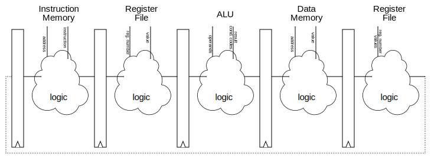

---
title: Processors
...

# Pipelining

Real processors *pipeline* instructions:
that is, they split up the work of a single instruction
into several components and divide them up into multiple steps.

{.example ...}
The "standard 5-stage pipeline" is

1. Fetch, reads an instruction from memory
2. Decode, retrieves values from registers
3. Execute, uses the ALU
4. Memory, reads or writes to one address of memory
5. Writeback, puts results into register

For example, the instruction `pushq %r8`, would

1. Fetch that instruction from memory
2. Detect it is a `push` and read the values of `%r8` and `%rsp` from the register file
3. Compute the new value for `%rsp` by sending `%rsp`'s value and `$-8` into the ALU
4. Send the value of `%r8` to memory to be written at the address `%rsp - $8`
5. Send the new `%rsp` back to the register file
{/}

Pipelining adds "pipeline registers" between each stage
which handle moving instructions one stage at a time.
Because registers require a clock signal to change values,
this means that a single instruction moves from stage to stage across several clock cycles.

{.example ...} Consider the following code

    evaluate:
        xorl    %eax, %eax
        cmpq    $1, %rdi
        je      evaluate_end
        movl    $1, %ecx
    evaluate_loop:
        incq    %rax
        movq    %rdi, %rdx
        sarq    %rdx
        testb   $1, %dil
        leaq    1(%rdi,%rdi,2), %rdi
        cmovneq %rdx, %rdi
        cmpq    %rcx, %rdi
        jne     evaluate_loop
    evaluate_end:
        retq

Three cycles after calling this function,
the state of the processor would look like

<table border="0" width="100%"><tbody>
<tr><td colspan="5">

</td></tr>
<tr><td width="20%" style="text-align:center">je</td>
<td width="20%" style="text-align:center">cmpq</td>
<td width="20%" style="text-align:center">xorl</td>
<td width="20%" style="text-align:center">callq</td>
<td width="20%" style="text-align:center"></td>
</tr></tbody></table>

The last stage would presumably still be working on the code that called this function.
{/}

Because an instruction begins working before all previous instructions have finished,
sometimes it is necessary to wait, staying in one stage until an earlier instruction finishes and provides needed data.

{.example ...} Continuing the last example,
the instruction after `je` cannot be loaded until the `cmpq` sets condition codes
and the `je` checks them.
Thus, the next several cycles will look like

<table border="0" width="100%"><tbody>
<tr><td colspan="5">

</td></tr>
<tr><td width="20%" style="text-align:center"></td>
<td width="20%" style="text-align:center">je</td>
<td width="20%" style="text-align:center">cmpq</td>
<td width="20%" style="text-align:center">xorl</td>
<td width="20%" style="text-align:center">callq</td>
</tr>
<tr><td colspan="5">
</td></tr>
<tr><td width="20%" style="text-align:center"></td>
<td width="20%" style="text-align:center"></td>
<td width="20%" style="text-align:center">je</td>
<td width="20%" style="text-align:center">cmpq</td>
<td width="20%" style="text-align:center">xorl</td>
</tr>
<tr><td colspan="5">
</td></tr>
<tr><td width="20%" style="text-align:center">movl</td>
<td width="20%" style="text-align:center"></td>
<td width="20%" style="text-align:center"></td>
<td width="20%" style="text-align:center">je</td>
<td width="20%" style="text-align:center">cmpq</td>
</tr>
</tbody></table>

The above diagram assumes that `je` can check condition codes 
using the ALU before the preceding `cmpq` has fully finished being executed.
{/}
