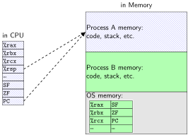
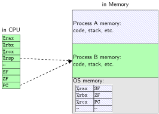

### switching programs 

* OS starts running somehow 

   * some sort of exception

* saves old registers + program counter + address mapping 

   * (optimization: could omit when program crashing/exiting)

* sets new registers + address mapping, jumps to new program counter
* called <em>context switch</em>  

   * saved information called <em>context</em>

### contexts (A running) 

### contexts (B running) 

