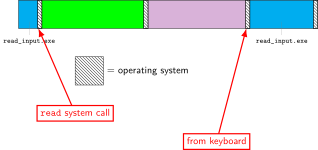

### keyboard input timeline 

{fig-alt="Timeline showing processor activity on a keypress. A program called read_input.exe makes a read system call, causing the operating system to run other programs for a while. Then, an event from the keyboard triggers the operating system to run, and it chooses to resume read_input.exe"}

