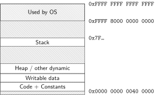

### program memory 

### againframe(progMemory)

### againframe(addrSpace)

### againframe(progMem)

### againframe(addrSpace)

### address space mechanisms 

* topic after exceptions
* called <em>virtual memory</em>
* mapping called <em>page tables</em>
* mapping part of what is changed in context switch

