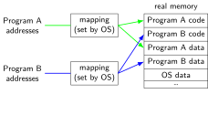
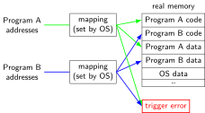
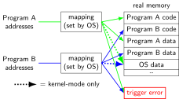

### program memory (two programs) 

::: {.r-stack .my-full}
{.fragment .fade-in-then-out fragment-index=1}

{.fragment .fade-in-then-out fragment-index=2}

{.fragment .fade-in-then-out fragment-index=3}

:::

### address space 

* programs have <em>illusion of own memory</em>
* called a program's <em>address space</em>
 
::: {.r-stack}
{.fragment .fade-in-then-out fragment-index=1}

{.fragment .fade-in-then-out fragment-index=2}

{.fragment .fade-in-then-out fragment-index=3}

:::

### againframe(progMem)

### againframe(addrSpace)

### address space mechanisms 

* topic after exceptions
* called <em>virtual memory</em>
* mapping called <em>page tables</em>
* mapping part of what is changed in context switch

