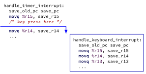
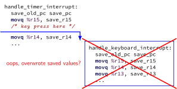
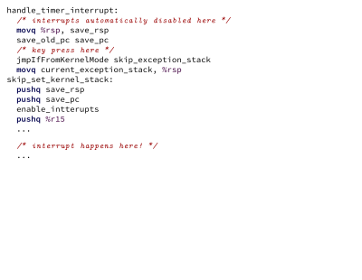
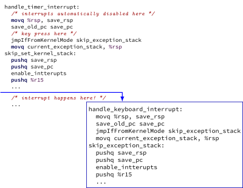

### exceptions in exceptions 


::: {.r-stack .my-full}
{.fragment .fade-in-then-out fragment-index=1}

{.fragment .fade-in-then-out fragment-index=2}

{.fragment .fade-in-then-out fragment-index=3}

:::


### interrupt disabling  {.smaller}


* CPU supports <em>disabling</em> (most) interrupts
* interrupts will <em>wait</em> until it is reenabled
* CPU has extra state: 

   * are interrupts enabled?
   * is keyboard interrupt pending?
   * is timer interrupt pending?


### exceptions in exceptions 

<!-- \lstset{
    language=myasm,
    style=small,
    moredelim=**[is][\btHL<1|handout:1>]{@1}{@},
    moredelim=**[is][\btHL<2|handout:2>]{@2}{@},
    moredelim=**[is][\btHL<3|handout:3>]{@3}{@},
    moredelim=**[is][\btHL<4|handout:4>]{@4}{@},
} -->
 
::: {.r-stack}
{.fragment .fade-in-then-out fragment-index=1}

{.fragment .fade-in-then-out fragment-index=2}

{.fragment .fade-in-then-out fragment-index=3}

:::


### disabling interrupts  {.smaller}


* automatically disabled when exception handler starts
* also can be done with privileged instruction:
 
```
change_keyboard_parameters:
  disable_interrupts
  ...
  /* change things used by
     handle_keyboard_interrupt here */
  ...
  enable_interrupts
```

