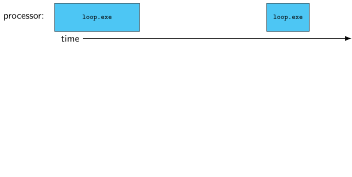
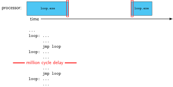
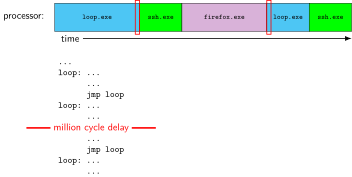

### time multiplexing 

::: {.r-stack .my-full}
{.fragment .fade-in-then-out fragment-index=1 fig-alt="Timeline showing loop.exe as active for some time, then nothing active, then loop.exe active"}

{.fragment .fade-in-then-out fragment-index=2 fig-alt="Same diagram, with the assembly instructions listed from an infinite loop, showing a &quot;million cycle delay&quot; where loop.exe is inactive."}

{.fragment .fade-in-then-out fragment-index=3 fig-alt="Same diagram, but now the inactive period is filled by ssh.exe and firefox.exe."}

:::

