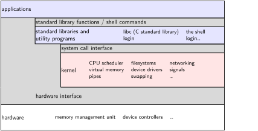
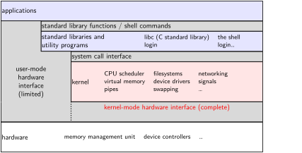
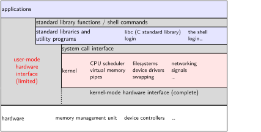
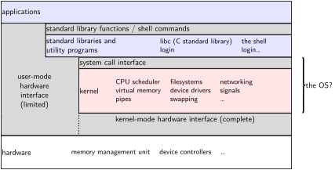
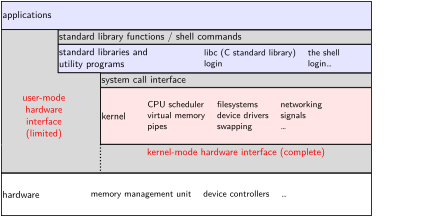

### the classic Unix design 

::: {.r-stack .my-full}
{.fragment .fade-in-then-out fragment-index=1}

{.fragment .fade-in-then-out fragment-index=2}

{.fragment .fade-in-then-out fragment-index=3}

{.fragment .fade-in-then-out fragment-index=4}

{.fragment .fade-in-then-out fragment-index=5}

{.fragment .fade-in-then-out fragment-index=6}

:::

### aside: is the OS the kernel?  {.smaller}

* OS = stuff that runs in kernel mode?
* OS = stuff that runs in kernel mode + libraries to use it?
* OS = stuff that runs in kernel mode + libraries + utility programs (e.g. shell, finder)?
* OS = everything that comes with machine? 

* no consensus on where the line is
* each piece can be replaced separately…

